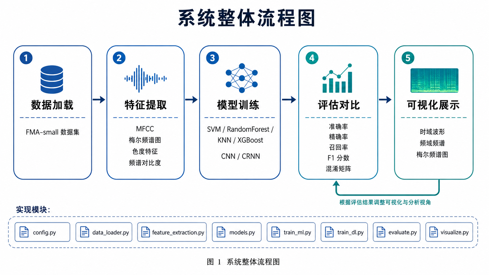
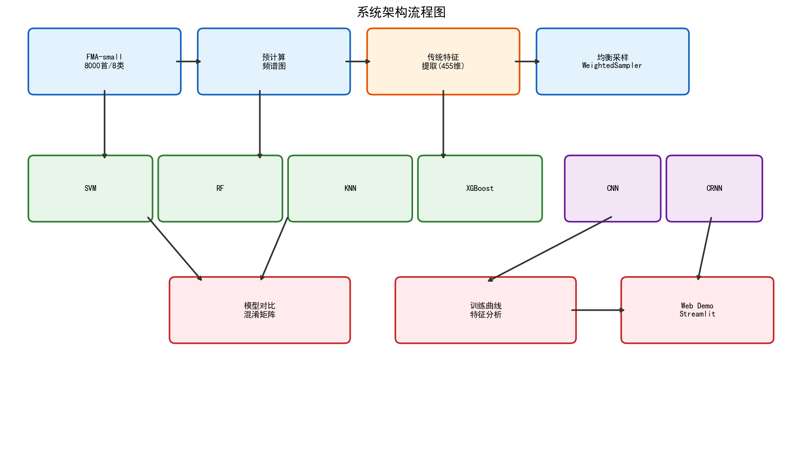
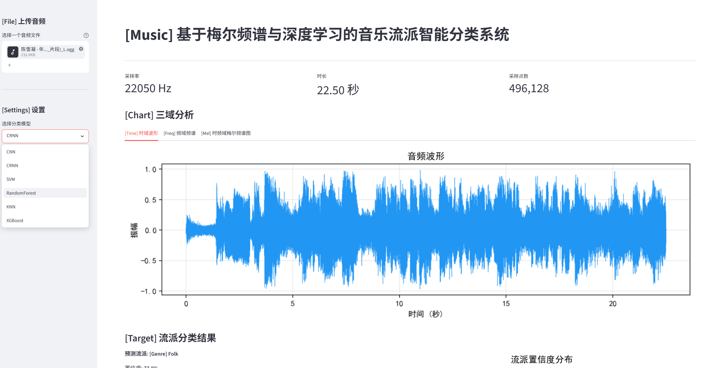

# 基于梅尔特征与深度学习的音乐流派智能分类系统

## 项目简介

基于FMA-small公开数据集，通过提取音频多维特征（MFCC、梅尔频谱、色度特征等），对比传统机器学习和深度学习方法，实现8种音乐流派的自动分类。

## 系统架构





## Demo演示



## 技术亮点

- **6种模型对比**：SVM、随机森林、KNN、XGBoost、CNN、CRNN
- **多维特征提取**：时域（过零率、RMS能量）、频域（频谱质心、带宽）、时频域（MFCC、梅尔频谱、色度特征）
- **Web Demo**：基于Streamlit的交互式演示界面
- **完整评估**：准确率、混淆矩阵、训练曲线可视化

## 项目结构

```
speech/
├── src/                  # 核心代码
│   ├── config.py         # 全局配置
│   ├── data_loader.py    # 数据加载
│   ├── feature_extraction.py  # 特征提取
│   ├── dataset.py        # PyTorch Dataset
│   ├── models.py         # CNN/CRNN模型定义
│   ├── train_ml.py       # 传统ML训练
│   ├── train_dl.py       # 深度学习训练
│   ├── evaluate.py       # 评估模块
│   ├── visualize.py      # 可视化
│   ├── ensemble.py       # 模型集成
│   └── precompute.py     # 预计算频谱图
├── main.py               # 主入口
├── app.py                # Streamlit Demo
├── requirements.txt      # 依赖
└── .gitignore
```

## 快速开始

### 1. 安装依赖

```bash
pip install -r requirements.txt
```

### 2. 下载数据集

从 [Kaggle](https://www.kaggle.com/datasets/andradaolteanu/gtzan-dataset-music-genre-classification) 下载GTZAN数据集，或从 [Zenodo](https://os.unil.cloud.switch.ch/fma/fma_small.zip) 下载FMA-small数据集。

解压至 `data/` 目录。

### 3. 预计算频谱图

```bash
python -m src.precompute
```

### 4. 运行实验

```bash
python main.py              # 完整实验
python main.py --ml-only    # 只运行传统ML
python main.py --dl-only    # 只运行深度学习
```

### 5. 启动Web Demo

```bash
streamlit run app.py
```

## 实验结果

| 模型 | 准确率 | F1分数 |
|------|--------|--------|
| XGBoost | 59.8% | 59.5% |
| SVM | 58.3% | 57.9% |
| CRNN | 57.1% | 56.2% |
| CNN | 56.0% | 54.5% |
| RandomForest | 52.6% | 52.0% |
| KNN | 49.5% | 47.9% |

## 技术栈

| 模块 | 技术 |
|------|------|
| 音频处理 | librosa |
| 机器学习 | scikit-learn, XGBoost |
| 深度学习 | PyTorch |
| 可视化 | matplotlib, seaborn |
| Web应用 | Streamlit |
